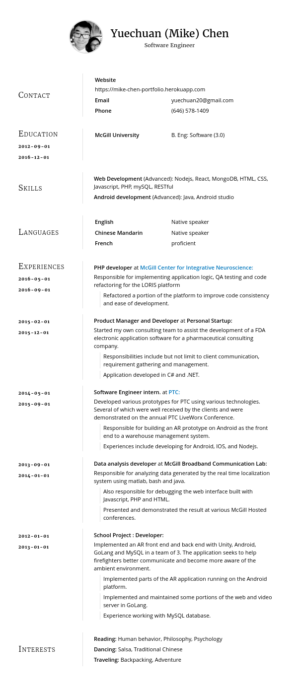

Written in [JSONResume](https://jsonresume.org/) format to replace my previous resume.

# Compilation

```bash
hackmyresume build resume.json to out/resume.all -t './node_modules/jsonresume-theme-paper' -p phantom

```

## Requirements

- `phantomjs` to compile to pdf 
- Looks best with [jsonresume-theme-paper](https://github.com/TimDaub/jsonresume-theme-paper) or check out my modified [theme](https://github.com/cyc115/jsonresume-theme-paper-tweaked)


# Example
